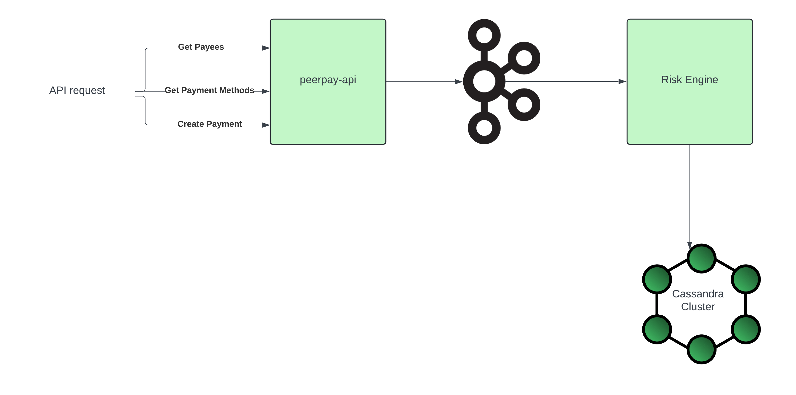

# peer-pay

## Peer to Peer payment system

### Modules
1. Common models
2. Rest API layer
3. Risk Engine

### Data Flow architecture




### How to run the application

# Prerequisites
1. Java 8
2. Maven 3.6.3
3. Docker

# Steps
1. Clone the repository
2. To spin up the kafka broker and cassandra database, run the following command
```docker-compose up --build```
3. Create the keyspace and table in cassandra by running the following command
```docker exec -it cassandra cqlsh -u "admin" -p "admin" -f /peer-pay/risk-engine/schema.cql```
3. cd into the project directory and run the following command
```mvn clean install```
4. To start the rest api, run the following command
```cd peerpay-api```
```java -jar target/peerpay-api-1.0-SNAPSHOT.jar```
5. To start the risk engine, run the following command
```cd risk-engine```
```java -jar target/risk-engine-1.0-SNAPSHOT.jar```

The application is now up and running. You can now make requests to the rest api.
Please refer to peerpay-api/resources/payees.json for loaded payee data.

### API Endpoints

1. GET /peer-pay/payees?name={name}
```curl --location 'http://localhost:8080/peer-pay/payees?name=Mich```

2. GET /peer-pay/payees/{id}/payment-methods
```curl --location 'http://localhost:8080/peer-pay/payees/8015622d-8914-49dd-a564-637615622d90/payment-methods```

3. POST /peer-pay/payments
```
curl --location 'http://localhost:8080/peer-pay/payment' \
--header 'Content-Type: application/json' \
--data '{
    "currency" : "USD",
    "payeeId" : "04bb2f76-9fb9-48e8-813c-734418350569",
    "userId" : "0195a2c1-f8da-48af-90be-dccdb9d7c73c",
    "idempotencyKey" : "2c044f2c-fc8b-4f09-87a9-9d312197f180",
    "amount" : 123,
    "paymentMethod" : "5adc329a-af5d-4d26-b3a8-bb8ef2378ca8"
}'
```

### Risk Engine

You can see the approval or rejected status of a payment by checking the logs of the risk engine.

### Cassandra database schema

The immutable append only payment processing table schema is as follows:

```
CREATE TABLE IF NOT EXISTS peer_payments.payment_processing (
    transaction_id UUID,         // Partition key (unique identifier for the payment)
    updated_time BIGINT,  // Clustering key (for ordering status)
    status TEXT,          // The payment status at this point in time
    metadata TEXT,          // Any other relevant details for this status update
    PRIMARY KEY (transaction_id, updated_time)
) WITH CLUSTERING ORDER BY (updated_time DESC);
```